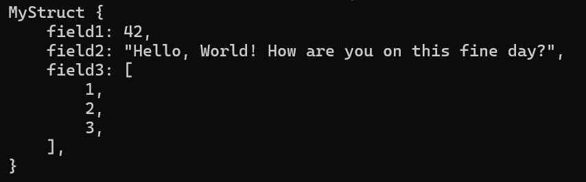
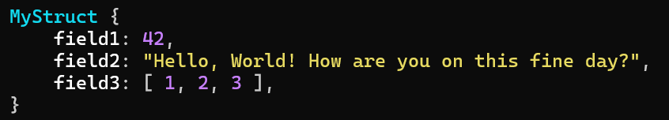

# chroma-dbg
*Put your primate brain's pattern recognition to use with syntax highlighting for the standard Debug trait*

 

## What is this?
`chroma-dbg` is a Rust library that provides syntax highlighting for the standard `Debug` trait. 
It works by taking the output of your regular `Debug` implementation, parsing it, and then re-printing it with customizable syntax highlighting, indentation and inlining.

## Example

```rust
#[derive(Debug)] // Regular std Debug derive macro, no tricks
struct MyStruct {
    field1: i32,
    field2: String,
    field3: Vec<i32>,
}

let my_struct = MyStruct {
    field1: 42,
    field2: "Hello, World!".to_string(),
    field3: vec![1, 2, 3],
};

// Print the struct with standard syntax highlighting
println!("{:#?}");
```
The output will look like this:

So much wasted space for that array! So hard on the eyes! Disgusting!

Now, let's use `chroma-dbg` to make it look fancy:
```rust
use chroma_dbg::ChromaDebug; // Helper trait that's automatically implemented for all types that implement Debug
println!("{}", my_struct.chroma_dbg());
```

The output will look like this:


Much better! 🎉

Check out the [sample](examples/sample.rs) for a more extensive example which demonstrates how you can customize the formatting.

## Disclaimer: Custom debug implementations
`chroma-dbg` works well enough with the standard Debug derive macro, but it isn't quite hardened against wacky debug formatting yet, which may cause the parser to fail. If that happens, the `dbg_chroma()` method will fall back to the regular `Debug` implementation..

If you encounter such a case, please open an issue with the debug output that caused the problem, and I will try to make the parser play nice with more wild syntaxes.